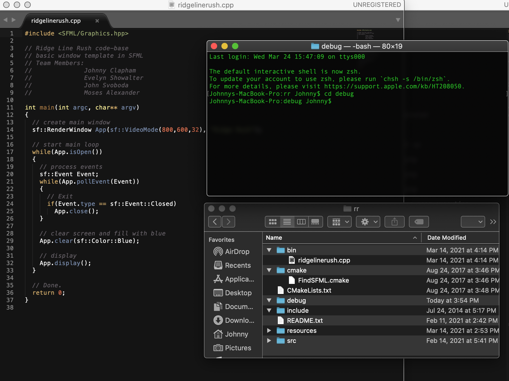
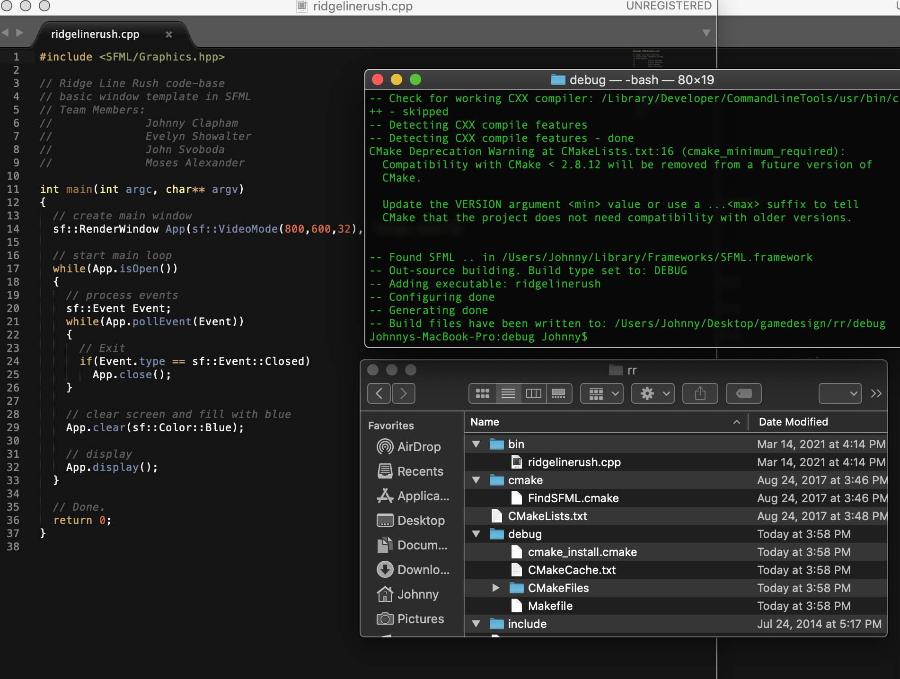
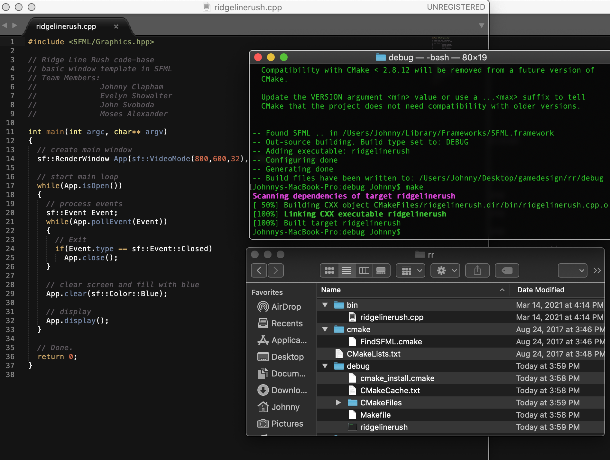

# ridgelinerush

CSCI 437: Introduction to Game Design and Development

# Team members:

Johnny Clapham

Evelyn Showalter

John Svoboda

Moses Alexander

# Game demo:

https://www.youtube.com/watch?v=qr5TzYzKBxo

# File Structure, Set-up, compilation of code, generation of executable:

1. Initial state: you can see the file structure. We `cd` into the manually created debug directory

2. Second state: we type `cmake ..`  in order to populate the debug folder with necessary files to run our next command

3. Our final state: we type `make`  to generate our executable, which will be placed inside of the debug folder. Executables can be run via `./name.exe`

